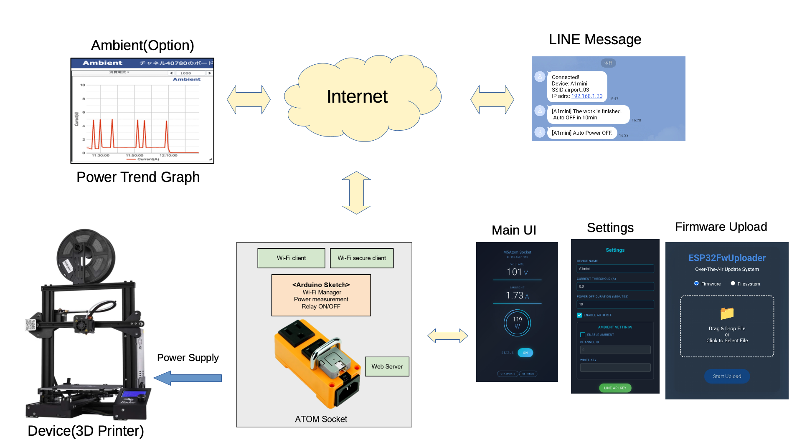
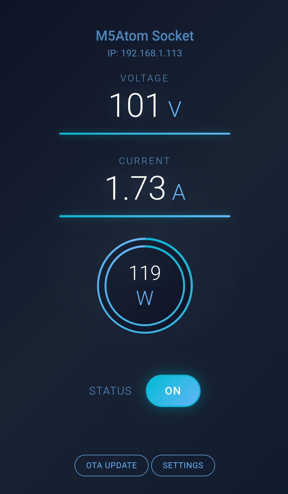
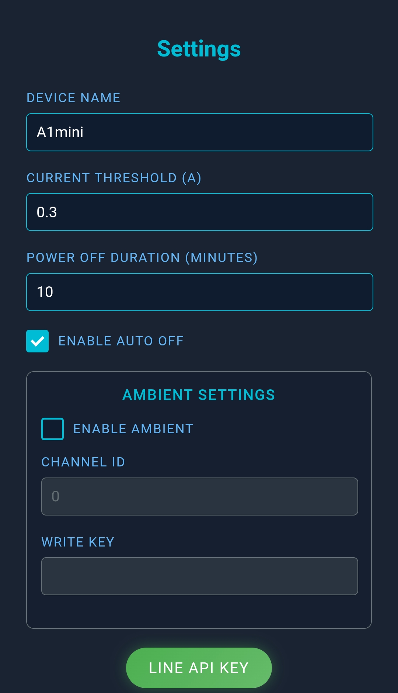
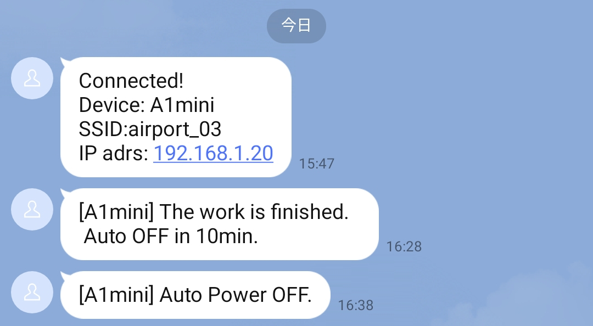

# M5Atom-Socket-examples

### System

## M5Atom Socket with Line Messaging API Example
The customized example for connectiong to Wi-Fi by using WiFi Manager and adding OTA Update function.

[Latest example](/M5Atom_Socket_LineMessagingAPI)

### Web UI

### Settings

### OTA Update

### IP Address and fihished Message

### Power Trend using ambient(Optional)

https://ambidata.io/

