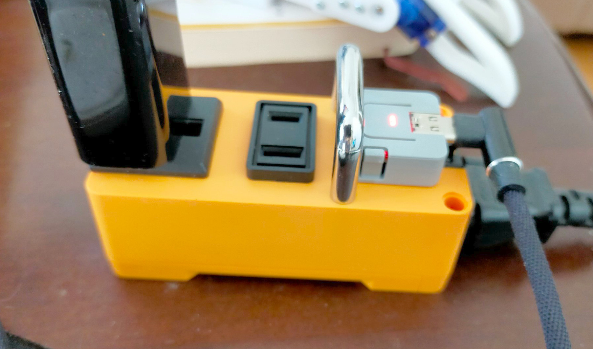
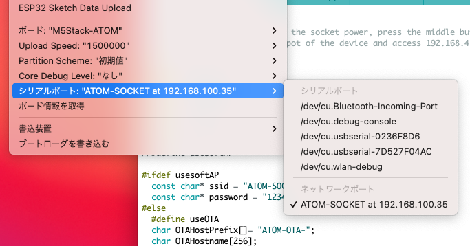
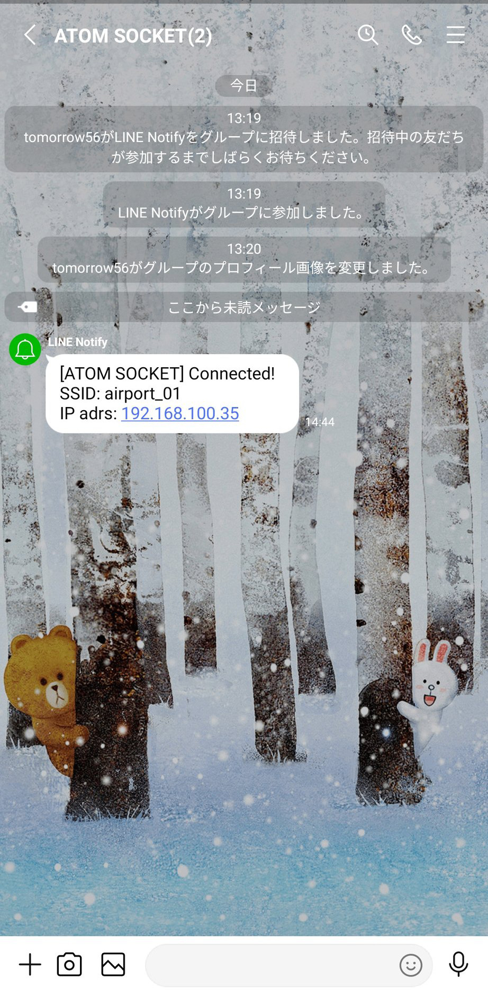

# M5Atom-Socket-examples

## M5Atom_Socket_test_web
The customized sample for connectiong to Wi-Fi router by using WiFi Manager and adding OTA of ArduinoIDE.
### connect to Wi-Fi router

### OTA connection

## M5Atom_Socket_test_LineNotify
Connect to Wi-Fi router and send IP address of device to LINE Notify.
The following article was used as a reference.
https://qiita.com/mine820/items/53c2a833937f1186539f

### LINE Notify message

