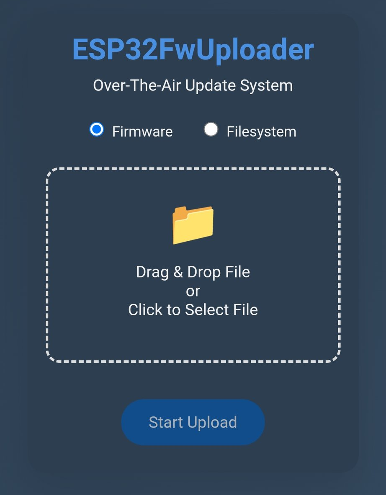

# M5Atom-Socket-examples

### System

## M5Atom Socket with Line Messaging API Example
The customized example for connectiong to Wi-Fi by using WiFi Manager and adding OTA Update function.

[Latest example](/M5Atom_Socket_LineMessagingAPI)

### Web UI

### OTA Update by Elagant OTA

### IP Address notification Message

### Power Trend using ambient

https://ambidata.io/

